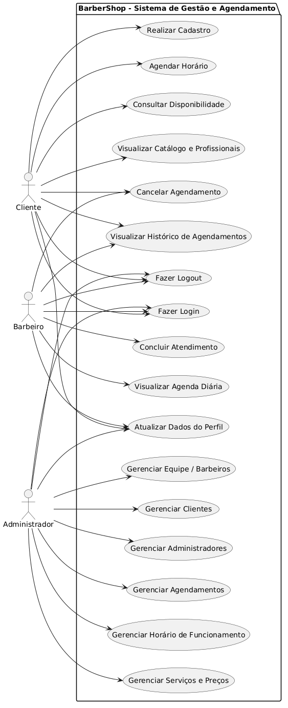
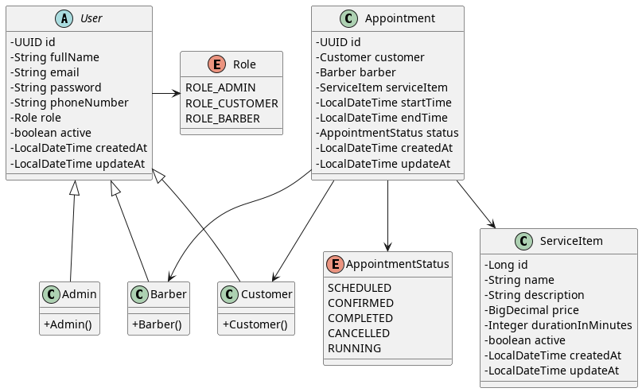

# Barbearia do Zé - Sistema de Gestão e Agendamento

## 📖 Contexto do Projeto

Este projeto consiste no desenvolvimento de uma aplicação web completa (Full-Stack) voltada para a gestão e automação de agendamentos de uma barbearia profissional. O objetivo principal é digitalizar o processo de reservas, eliminando falhas como sobreposição de horários e ineficiências de comunicação, além de fornecer um painel de controle para a equipe gerenciar suas rotinas.

A plataforma permite que clientes realizem cadastros, visualizem o catálogo, escolham profissionais e selecionem horários disponíveis de forma dinâmica. O sistema atende aos requisitos de engenharia de software integrando um front-end moderno, uma API RESTful robusta e um banco de dados relacional para persistência transacional.

## 🚀 Funcionalidades e Casos de Uso Principais

- **Vitrine Digital:** Catálogo de serviços com preços e duração estimada.
- **Agendamento Inteligente:** Interface em etapa única para escolha de serviço, profissional e horário, com validação de concorrência e cálculo de disponibilidade.
- **Painel do Cliente:** Área restrita para visualização do histórico e cancelamento de agendamentos. Dados do perfil obtidos diretamente do token JWT.
- **Painel do Profissional/Admin:** Visualização da agenda diária e alteração do status dos atendimentos.
- **Segurança:** Autenticação de usuários via token JWT (Bearer Token) e Controle de Acesso Baseado em Funções (RBAC).
- **Documentação da API:** Documentação interativa gerada automaticamente via OpenAPI/Swagger (SpringDoc) e depois melhorada com Redoc.
- **Deploy com Docker:** Backend conteinerizado com Docker Compose (PostgreSQL + Spring Boot).

## Protótipo de baixa fidelidade (Figma)

[Clique aqui para ver o protótipo de baixa fidelidade](https://www.figma.com/proto/CwY0O0aQ68XZcSvtAhbghI/Prot%C3%B3tipo---Barbearia?node-id=3-2&t=eWMBRIBa3ZeJAf1a-1&scaling=scale-down&content-scaling=fixed&page-id=0%3A1&starting-point-node-id=3%3A2)

## 📚 Documentação do Projeto

Para facilitar a compreensão do funcionamento do sistema, o repositório conta com uma documentação técnica completa:

- 🏛️ **[Arquitetura do Sistema](docs/architecture.md)**: Visão detalhada da organização física e lógica das camadas do back-end, estrutura do front-end e fluxo de autenticação e dados.
- 🔌 **[Referência da API REST](docs/api_reference.md)**: Lista completa dos endpoints REST, parâmetros esperados, modelos de dados e controle de acesso (RBAC). [Clique aqui para ver a documentação da API](https://barbeariadoze.duckdns.org).
- 🗄️ **[Esquema do Banco de Dados](docs/database_schema.md)**: Mapeamento de tabelas, chaves primárias e estrangeiras, tipos de dados e explicação da herança relacional (`tb_user`).

### 📊 Diagramas do Sistema

#### Diagrama de Casos de Uso

O diagrama mapeia as interações dos atores (Cliente, Barbeiro, Administrador) com o sistema.

- 📝 **Código-fonte**: [diagram_use_case.puml](docs/diagram_use_case.puml)
- 🖼️ **Imagem**:
  

#### Diagrama de Classes

O diagrama detalha a estrutura de objetos e entidades de domínio do banco de dados relacional.

- 📝 **Código-fonte**: [diagram_classes.puml](docs/diagram_classes.puml)
- 🖼️ **Imagem**:
  

## 💻 Tecnologias Utilizadas

**Front-end:**

- Next.js 16
- React 19
- Tailwind CSS 4
- TypeScript 5

**Back-end & API REST:**

- Java 21
- Spring Boot 4
- Autenticação JSON Web Tokens (JWT)
- Documentação OpenAPI e Redoc

**Banco de Dados:**

- PostgreSQL 16

**Infraestrutura:**

- Docker & Docker Compose (Backend + PostgreSQL) em uma VPS da Oracle Free Tier com DNS da Duckdns e certificado SSL do nginx
- Vercel (Frontend)

## 📁 Estrutura do Repositório

O projeto adota a arquitetura de repositório único (monorepo) para facilitar a avaliação e o versionamento:

```
├── .env                  # Variáveis de ambiente (backend + frontend) — NÃO versionado
├── backend/
│   ├── .env              # Cópia das variáveis de ambiente para o backend — NÃO versionado
│   ├── Dockerfile        # Build multi-stage do backend (Maven + JRE Alpine)
│   ├── docker-compose.yml  # Orquestração PostgreSQL + Backend
│   ├── pom.xml           # Dependências Maven do Spring Boot
│   └── src/              # Código-fonte Java (Controllers, Services, Models, Security)
├── frontend/
│   ├── .env.local        # Variáveis de ambiente do Next.js — NÃO versionado
│   ├── app/              # Páginas, componentes, contextos e serviços (App Router)
│   │   ├── services/api.ts   # Camada centralizada de integração com a API
│   │   ├── contexts/         # AuthContext, ToastContext
│   │   └── components/       # Componentes reutilizáveis (Navbar, Footer, Toast)
│   ├── lib/auth.ts       # Utilitários de decodificação JWT
│   └── package.json      # Dependências npm
└── docs/                 # Documentação técnica, diagramas UML e esquemas
```

## ⚙️ Instruções de Instalação e Execução

### Pré-requisitos

- Node.js (v18+)
- Java JDK 21 (ou superior) e Maven
- PostgreSQL instalado e rodando (porta 5432)
- Docker e Docker Compose (opcional, para deploy conteinerizado)

### 1. Configuração das Variáveis de Ambiente

Todas as configurações sensíveis (senhas, chaves JWT, URLs) são gerenciadas por variáveis de ambiente. Os arquivos `.env` **não são versionados** por segurança.

#### Arquivo `.env` (raiz do projeto)

Crie o arquivo `.env` na raiz do projeto com as seguintes variáveis:

```env
# Backend (Spring Boot)
DB_URL=jdbc:postgresql://localhost:5432/nome_do_banco
DB_USER=seu_usuario
DB_PASS=sua_senha
MASTER_PASS=chave_secreta_jwt
DB_DDL_AUTO=update
CORS_ORIGINS=http://localhost:3000
TOKEN_ISSUER=nome_do_issuer
TOKEN_EXPIRATION_HOURS=2
TOKEN_TIMEZONE_OFFSET=-03:00

# Frontend (Next.js)
NEXT_PUBLIC_API_URL=http://localhost:8080/api
NEXT_PUBLIC_API_DOCS=http://localhost:8080/v3/api-docs
```

#### Arquivo `frontend/.env.local`

Crie o arquivo `.env.local` dentro de `/frontend` com as variáveis do Next.js:

```env
NEXT_PUBLIC_API_URL=http://localhost:8080/api
NEXT_PUBLIC_API_DOCS=http://localhost:8080/v3/api-docs
```

> **Nota:** Para deploy em produção, substitua `localhost` pelo endereço IP ou domínio do servidor backend.

### 2. Rodando o Front-end

```bash
cd frontend
npm install
npm run dev
```

Acesse no navegador: `http://localhost:3000`

### 3. Rodando o Back-end

#### Opção A: Execução Local com Maven

```bash
cd backend
mvn spring-boot:run
```

A API estará disponível em: `http://localhost:8080`

#### Opção B: Execução com Docker Compose

```bash
cd backend
docker compose up -d
```

O Docker Compose irá provisionar automaticamente o PostgreSQL e o backend Spring Boot.

### 4. Documentação da API (Swagger/OpenAPI)

Após iniciar o backend, a documentação interativa estará disponível em:

- **Swagger UI**: `http://localhost:8080/swagger-ui.html`
- **OpenAPI JSON**: `http://localhost:8080/v3/api-docs`
- **Redoc**: `http://localhost:8080/docs`

## 🔒 Segurança e Autenticação

O sistema utiliza **JWT (JSON Web Tokens)** para autenticação stateless:

1. O cliente faz login via `POST /api/auth/login` com e-mail e senha.
2. O servidor retorna um token JWT assinado contendo o `id`, `email` e `role` do usuário.
3. O frontend armazena o token no `localStorage` e o envia no cabeçalho `Authorization: Bearer <token>` em todas as requisições autenticadas.
4. O filtro `SecurityFilter` do Spring Security intercepta cada requisição, valida o token e aplica as regras de RBAC.

### Controle de Acesso (RBAC)

| Papel           | Descrição                                                                                          |
| :-------------- | :------------------------------------------------------------------------------------------------- |
| `ROLE_ADMIN`    | Acesso total ao sistema. Gerencia barbeiros, serviços, horários e visualiza todos os agendamentos. |
| `ROLE_BARBER`   | Visualiza e gerencia a própria agenda. Pode listar clientes.                                       |
| `ROLE_CUSTOMER` | Realiza agendamentos, visualiza e cancela seus próprios compromissos e edita seu perfil.           |

## 📄 Licença

Este projeto está licenciado sob a **PolyForm Noncommercial License 1.0.0**. Consulte o arquivo [PolyForm-Noncommercial-1.0.0.md](PolyForm-Noncommercial-1.0.0.md) para mais detalhes.
