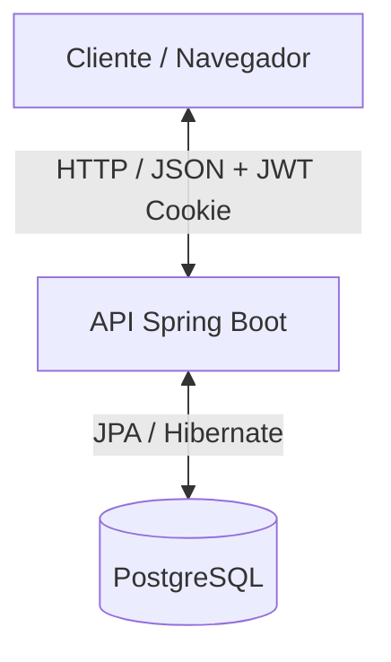
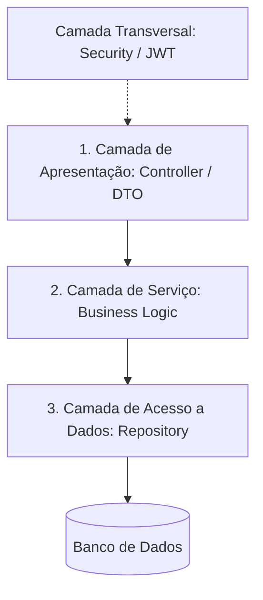
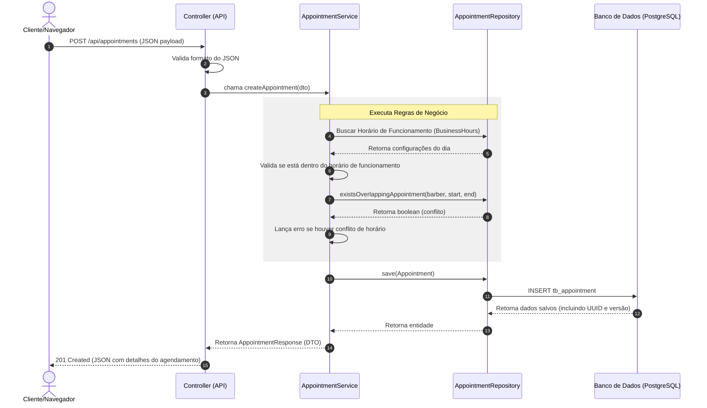

# Arquitetura do Sistema - BarberShop

Este documento descreve a arquitetura e os padrões de projeto adotados no **BarberShop**, um sistema completo (Full-Stack) para agendamentos e gestão de barbearias.

---

## 🏛️ Visão Geral da Arquitetura

O sistema adota uma arquitetura cliente-servidor desacoplada:

1. **Front-end**: Uma aplicação baseada em **Next.js** (React) focada em usabilidade, com suporte mobile-first e interface rica.
2. **Back-end**: Uma API RESTful desenvolvida com **Spring Boot 3** e **Java 21**, responsável pelo processamento de regras de negócio, segurança e persistência de dados.
3. **Banco de Dados**: Um banco relacional SQL (**PostgreSQL**) para garantir integridade e atomicidade nas transações.

---

## ☕ Arquitetura do Back-end

O back-end é estruturado seguindo o padrão de **Arquitetura em Camadas** (Layered Architecture), separando as responsabilidades de forma clara e limpa:

### 1. Camada de Apresentação (`com.barbershop.backend.application`)
- **Controllers (`controller/`)**: Pontos de entrada REST que expõem os endpoints da API. Eles recebem as requisições HTTP, validam os dados de entrada usando anotações de validação padrão do Spring e mapeiam os resultados para o cliente.
- **DTOs (`dto/`)**: Data Transfer Objects divididos em subpastas de `request` e `response`. São registros Java (`record`) imutáveis utilizados para transferir dados entre as requisições e as entidades de domínio, evitando vazamento de lógica interna de persistência.

### 2. Camada de Serviço (`com.barbershop.backend.service`)
- **Services (`service/`)**: Concentra a lógica de negócio (ex: cálculo de tempo de término do serviço, validações de conflito de horários de barbeiros, validação de funcionamento nos dias configurados, etc.).
- **Exceptions (`service.exception/`)**: Exceções customizadas que representam erros de domínio específicos (`BusinessRuleException` e `ResourceNotFoundException`), capturadas globalmente para retornar respostas HTTP adequadas.

### 3. Camada de Domínio e Persistência (`com.barbershop.backend.domain`)
- **Models (`model/`)**: Classes de entidade gerenciadas pelo Hibernate/JPA. A entidade `User` é a classe base para `Customer`, `Barber` e `Admin` usando a estratégia de herança relacional de tabelas separadas com chaves estrangeiras (`InheritanceType.JOINED`).
- **Repositories (`repository/`)**: Interfaces que herdam de `JpaRepository` ou `ListCrudRepository`, fornecendo acesso abstraído ao banco de dados com suporte a consultas dinâmicas (ex: detecção de sobreposição de horários via consulta personalizada JPA).

### 4. Camada de Infraestrutura (`com.barbershop.backend.infraestructure`)
- **Segurança (`security/`)**: Configuração do Spring Security. Contém o filtro de interceptação de token JWT, gerenciador de autenticação, criptografia de senhas usando `BCryptPasswordEncoder` e geração e validação de tokens via classe `TokenService`.

---

## 🌐 Arquitetura do Front-end

O front-end utiliza o **Next.js** estruturado de maneira modular:

- **Paginação**: Estruturada no diretório de páginas do Next.js.
- **Componentização**: Elementos de UI reutilizáveis (botões, modais, formulários de agendamento e grids de horários) desacoplados da lógica de visualização geral.
- **Gerenciamento de Estado**: Contextos globais em React (`Context API`) para controlar o estado de autenticação do usuário autenticado e persistência de sessão.
- **Estilização**: Uso intensivo de classes utilitárias do **Tailwind CSS** para produzir uma interface com design fluido, harmonioso, responsivo e adaptado para telas móveis.

---

## 🔒 Fluxo de Segurança (JWT & Cookies HttpOnly)

Para proteger a integridade do sistema e evitar ataques comuns de Web (XSS e CSRF), a segurança é estruturada da seguinte forma:

1. **Autenticação**: O cliente faz login fornecendo e-mail e senha no endpoint `/api/auth/login`.
2. **Emissão de Token**: O servidor autentica o usuário e gera um token JWT assinado digitalmente.
3. **Armazenamento**: O token JWT é anexado ao cabeçalho da resposta na forma de um **Cookie HttpOnly e SameSite=Lax**.
   - *HttpOnly* impede que scripts JavaScript do lado do cliente acessem o token (proteção contra XSS).
   - *SameSite=Lax* garante que o cookie seja enviado nas requisições do mesmo site e navegações seguras de terceiros.
4. **Autorização (RBAC)**: A cada requisição subsequente, o cookie é enviado automaticamente. O filtro `SecurityFilter` lê o token, autentica o usuário no contexto do Spring Security e valida a permissão baseada em seu papel (`ROLE_ADMIN`, `ROLE_BARBER` ou `ROLE_CUSTOMER`).

---

## 🔄 Fluxo de Dados de um Agendamento

O fluxo a seguir ilustra o ciclo de vida da criação de um agendamento:

