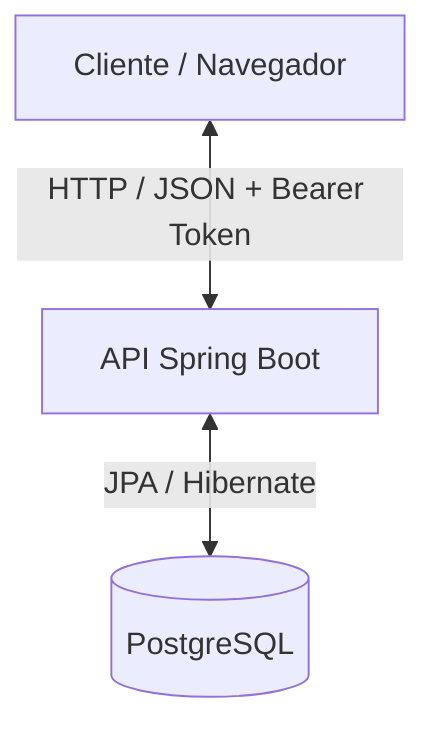
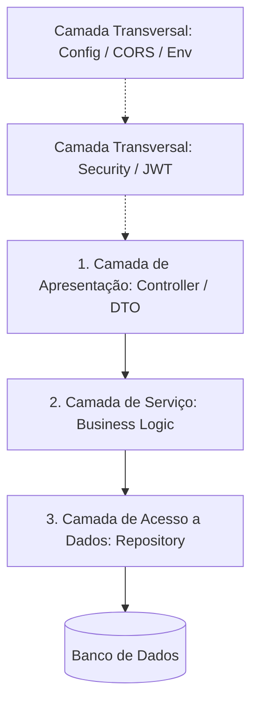
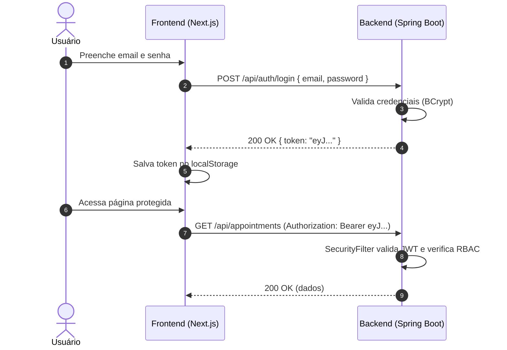
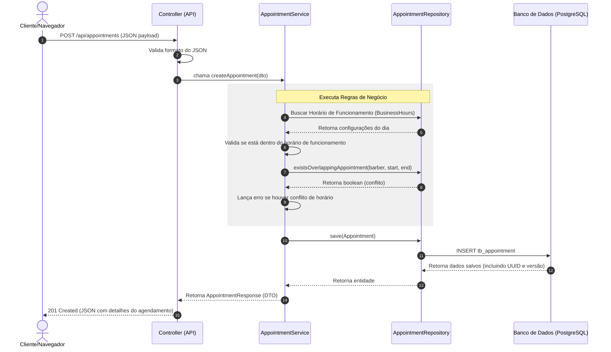

# Arquitetura do Sistema - Barbearia do Zé

Este documento descreve a arquitetura e os padrões de projeto adotados no **Barbearia do Zé**, um sistema completo (Full-Stack) para agendamentos e gestão de barbearias.

---

## 🏛️ Visão Geral da Arquitetura

O sistema adota uma arquitetura cliente-servidor desacoplada:

1. **Front-end**: Uma aplicação baseada em **Next.js 16** (React 19) focada em usabilidade, com suporte mobile-first e interface rica.
2. **Back-end**: Uma API RESTful desenvolvida com **Spring Boot 4** e **Java 21**, responsável pelo processamento de regras de negócio, segurança e persistência de dados.
3. **Banco de Dados**: Um banco relacional SQL (**PostgreSQL 16**) para garantir integridade e atomicidade nas transações.

---

## ☕ Arquitetura do Back-end

O back-end é estruturado seguindo o padrão de **Arquitetura em Camadas** (Layered Architecture), separando as responsabilidades de forma clara e limpa:

### 1. Camada de Apresentação (`com.barbershop.backend.application`)
- **Controllers (`controller/`)**: Pontos de entrada REST que expõem os endpoints da API. Eles recebem as requisições HTTP, validam os dados de entrada usando anotações de validação padrão do Spring e mapeiam os resultados para o cliente.
- **DTOs (`dto/`)**: Data Transfer Objects divididos em subpastas de `request` e `response`. São registros Java (`record`) imutáveis utilizados para transferir dados entre as requisições e as entidades de domínio, evitando vazamento de lógica interna de persistência.

### 2. Camada de Serviço (`com.barbershop.backend.service`)
- **Services (`service/`)**: Concentra a lógica de negócio (ex: cálculo de tempo de término do serviço, validações de conflito de horários de barbeiros, validação de funcionamento nos dias configurados, etc.).
- **Exceptions (`service.exception/`)**: Exceções customizadas que representam erros de domínio específicos (`BusinessRuleException` e `ResourceNotFoundException`), capturadas globalmente para retornar respostas HTTP adequadas.

### 3. Camada de Domínio e Persistência (`com.barbershop.backend.domain`)
- **Models (`model/`)**: Classes de entidade gerenciadas pelo Hibernate/JPA. A entidade `User` é a classe base para `Customer`, `Barber` e `Admin` usando a estratégia de herança relacional de tabelas separadas com chaves estrangeiras (`InheritanceType.JOINED`).
- **Repositories (`repository/`)**: Interfaces que herdam de `JpaRepository` ou `ListCrudRepository`, fornecendo acesso abstraído ao banco de dados com suporte a consultas dinâmicas (ex: detecção de sobreposição de horários via consulta personalizada JPA).

### 4. Camada de Infraestrutura (`com.barbershop.backend.infraestructure`)
- **Segurança (`security/`)**: Configuração do Spring Security. Contém o filtro de interceptação de token JWT (`SecurityFilter`), gerenciador de autenticação, criptografia de senhas usando `BCryptPasswordEncoder` e geração e validação de tokens via classe `TokenService`.
- **Configuração (`config/`)**: Classes de configuração do Spring que gerenciam CORS (`CorsConfig`), regras de segurança HTTP (`SecurityConfig`) e demais beans. Todas as configurações sensíveis são lidas de variáveis de ambiente via `@Value`.

### 5. Configuração por Variáveis de Ambiente

O backend utiliza variáveis de ambiente para externalizar toda a configuração sensível. O mapeamento é feito no `application.properties` usando a sintaxe `${VAR:default}`:

| Variável | Descrição | Valor Padrão |
| :--- | :--- | :--- |
| `DB_URL` | URL JDBC de conexão ao PostgreSQL | — |
| `DB_USER` | Usuário do banco de dados | — |
| `DB_PASS` | Senha do banco de dados | — |
| `MASTER_PASS` | Chave secreta para assinatura JWT | — |
| `DB_DDL_AUTO` | Estratégia DDL do Hibernate | `update` |
| `CORS_ORIGINS` | Origens permitidas (separadas por vírgula) | `http://localhost:3000` |
| `TOKEN_ISSUER` | Emissor do token JWT | `barbershop-api` |
| `TOKEN_EXPIRATION_HOURS` | Tempo de expiração do token (horas) | `2` |
| `TOKEN_TIMEZONE_OFFSET` | Fuso horário para cálculo de expiração | `-03:00` |

---

## 🌐 Arquitetura do Front-end

O front-end utiliza o **Next.js 16** com App Router, estruturado de maneira modular:

- **Paginação**: Estruturada no diretório `app/` usando o sistema de roteamento do Next.js App Router.
- **Componentização**: Elementos de UI reutilizáveis (Navbar, Footer, Toast) desacoplados da lógica de visualização geral, localizados em `app/components/`.
- **Camada de Serviço (`app/services/api.ts`)**: Centraliza todas as chamadas HTTP para o backend. Implementa autenticação automática via Bearer Token e interceptação de erros 401/403 com redirecionamento para login.
- **Gerenciamento de Estado**: Contextos globais em React (`Context API`) para controlar o estado de autenticação (`AuthContext`) e notificações visuais (`ToastContext`).
- **Utilitário de Autenticação (`lib/auth.ts`)**: Biblioteca centralizada para decodificação do token JWT e extração de informações do usuário (`id`, `email`, `role`, `exp`).
- **Estilização**: Uso intensivo de classes utilitárias do **Tailwind CSS 4** para produzir uma interface com design fluido, harmonioso, responsivo e adaptado para telas móveis.

### Variáveis de Ambiente do Frontend

| Variável | Descrição |
| :--- | :--- |
| `NEXT_PUBLIC_API_URL` | URL base da API backend (ex: `http://localhost:8080/api`) |
| `NEXT_PUBLIC_API_DOCS` | URL do endpoint OpenAPI/Swagger (ex: `http://localhost:8080/v3/api-docs`) |

> Configuradas no arquivo `frontend/.env.local` (não versionado).

---

## 🔒 Fluxo de Segurança (JWT Bearer Token)

A segurança do sistema é implementada com tokens JWT stateless e autenticação via cabeçalho `Authorization`:

1. **Autenticação**: O cliente faz login fornecendo e-mail e senha no endpoint `POST /api/auth/login`.
2. **Emissão de Token**: O servidor autentica o usuário e gera um token JWT assinado digitalmente contendo o `id`, `email` e `role` do usuário no payload.
3. **Armazenamento**: O token JWT é armazenado no `localStorage` do navegador pelo frontend.
4. **Autorização (RBAC)**: Em toda requisição subsequente, o frontend envia o token no cabeçalho `Authorization: Bearer <token>`. O filtro `SecurityFilter` lê o token, autentica o usuário no contexto do Spring Security e valida a permissão baseada em seu papel (`ROLE_ADMIN`, `ROLE_BARBER` ou `ROLE_CUSTOMER`).
5. **Expiração**: Quando o token expira ou é inválido, o backend retorna 401/403 e o frontend remove o token do `localStorage` e redireciona automaticamente para a página de login.

---

## 🔄 Fluxo de Dados de um Agendamento

O fluxo a seguir ilustra o ciclo de vida da criação de um agendamento:

---

## 🐳 Deploy com Docker

O backend inclui suporte completo a Docker para deploy em produção:

- **`Dockerfile`**: Build multi-stage (Maven build → JRE Alpine runtime) para imagens leves.
- **`docker-compose.yml`**: Orquestra o PostgreSQL 16 e o backend Spring Boot com health checks.

As variáveis de ambiente do Docker Compose são lidas do arquivo `.env` na raiz do projeto.
