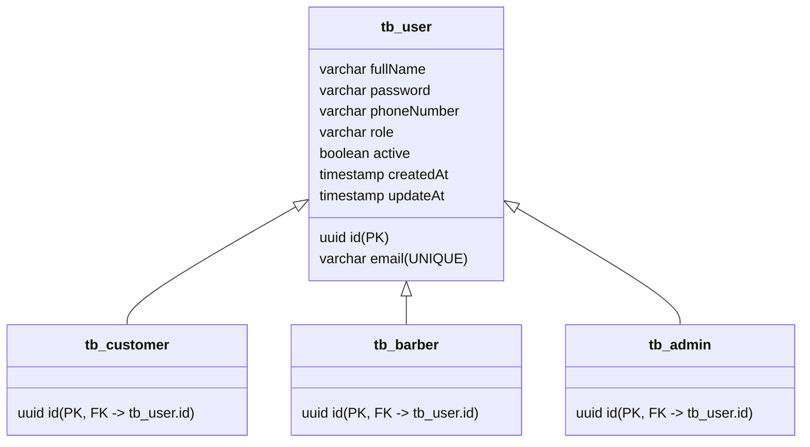

# Esquema do Banco de Dados - BarberShop

Este documento detalha o esquema de banco de dados relacional (PostgreSQL) gerado e gerenciado pelo mecanismo de mapeamento objeto-relacional (JPA/Hibernate) do back-end.

---

## 👥 1. Estrutura de Herança de Usuários (`tb_user` e derivadas)

O sistema utiliza a estratégia de mapeamento de herança **Joined** (`InheritanceType.JOINED`). As propriedades comuns dos usuários residem na tabela pai `tb_user`, enquanto as tabelas filhas contêm apenas chaves estrangeiras apontando para o ID da tabela pai.

### Tabela Pai: `tb_user`
Armazena os dados comuns para todos os usuários do sistema.

| Coluna | Tipo SQL | Restrições | Descrição |
| :--- | :--- | :--- | :--- |
| `id` | `uuid` | `PRIMARY KEY` | Identificador único do usuário. |
| `fullName` | `varchar(255)` | `NOT NULL` | Nome completo do usuário. |
| `email` | `varchar(255)` | `NOT NULL`, `UNIQUE` | E-mail corporativo/pessoal (usado para login). |
| `password` | `varchar(255)` | `NOT NULL` | Senha criptografada com algoritmo BCrypt. |
| `phoneNumber` | `varchar(255)` | `NOT NULL` | Telefone de contato. |
| `role` | `varchar(255)` | `NOT NULL` | Perfil de acesso (`ROLE_ADMIN`, `ROLE_CUSTOMER`, `ROLE_BARBER`). |
| `active` | `boolean` | `DEFAULT true` | Flag para desativação lógica (soft delete). |
| `createdAt` | `timestamp` | `NOT NULL` | Registro de data/hora de criação do registro. |
| `updateAt` | `timestamp` | `NOT NULL` | Registro de data/hora da última atualização. |

### Tabela Filho: `tb_customer`
Armazena a relação de clientes cadastrados.
- **PK/FK**: `id` (`uuid`) referencia `tb_user.id` com deleção em cascata.

### Tabela Filho: `tb_barber`
Armazena a relação de barbeiros profissionais.
- **PK/FK**: `id` (`uuid`) referencia `tb_user.id` com deleção em cascata.

### Tabela Filho: `tb_admin`
Armazena a relação de administradores do sistema.
- **PK/FK**: `id` (`uuid`) referencia `tb_user.id` com deleção em cascata.

---

## 🛠️ 2. Tabela de Catálogo de Serviços (`tb_service_item`)

Armazena os serviços oferecidos pela barbearia.

| Coluna | Tipo SQL | Restrições | Descrição |
| :--- | :--- | :--- | :--- |
| `id` | `bigint` | `PRIMARY KEY` (Auto-incremento / serial) | Identificador do serviço. |
| `name` | `varchar(255)` | `NOT NULL` | Nome do serviço (ex: "Corte de Cabelo"). |
| `description` | `varchar(255)` | `NOT NULL` | Detalhes sobre o serviço. |
| `price` | `numeric(38,2)`| `NOT NULL` | Preço cobrado em reais. |
| `durationInMinutes` | `int` | `NOT NULL` | Duração esperada em minutos (usada para reserva de horários). |
| `active` | `boolean` | `DEFAULT true` | Indica se o serviço está visível no catálogo. |
| `createdAt` | `timestamp` | `NOT NULL` | Data/hora de inclusão. |
| `updateAt` | `timestamp` | `NOT NULL` | Data/hora da última alteração. |

---

## 📅 3. Tabela de Agendamentos (`tb_appointment`)

Gere as reservas de horários dos clientes com os barbeiros.

| Coluna | Tipo SQL | Restrições | Descrição |
| :--- | :--- | :--- | :--- |
| `id` | `uuid` | `PRIMARY KEY` | ID único da reserva. |
| `customer_id` | `uuid` | `NOT NULL`, `FOREIGN KEY -> tb_customer.id` | Cliente que realizou o agendamento. |
| `barber_id` | `uuid` | `NOT NULL`, `FOREIGN KEY -> tb_barber.id` | Barbeiro que executará o serviço. |
| `service_item_id`| `bigint` | `NOT NULL`, `FOREIGN KEY -> tb_service_item.id` | Serviço reservado. |
| `startTime` | `timestamp` | `NOT NULL` | Horário de início do agendamento. |
| `endTime` | `timestamp` | `NOT NULL` | Horário estimado de término (startTime + duração do serviço). |
| `status` | `varchar(255)`| `NOT NULL` | Status da reserva (`SCHEDULED`, `CONFIRMED`, `COMPLETED`, `CANCELLED`, `RUNNING`). |
| `version` | `bigint` | `NOT NULL` | Usado pelo JPA para bloqueio otimista, prevenindo concorrência. |
| `createdAt` | `timestamp` | `NOT NULL` | Registro da criação do agendamento. |
| `updateAt` | `timestamp` | `NOT NULL` | Última modificação realizada no agendamento. |

---

## ⏰ 4. Tabela de Horário de Funcionamento (`business_hours`)

Determina os dias e horas em que a barbearia aceita agendamentos.

| Coluna | Tipo SQL | Restrições | Descrição |
| :--- | :--- | :--- | :--- |
| `dayOfWeek` | `int` | `PRIMARY KEY` | Dia da semana (1 = Segunda-feira, ..., 7 = Domingo). |
| `dayName` | `varchar(255)`| `NOT NULL` | Nome amigável do dia da semana (ex: "Segunda-feira"). |
| `open` | `boolean` | `NOT NULL` | Indica se a barbearia abre ou não neste dia. |
| `openTime` | `varchar(255)`| `NOT NULL` | Horário de abertura (ex: "09:00"). |
| `closeTime` | `varchar(255)`| `NOT NULL` | Horário de fechamento (ex: "18:00"). |
